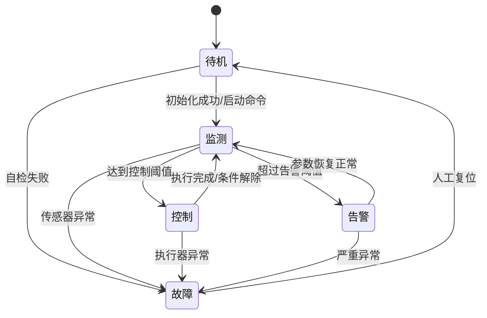
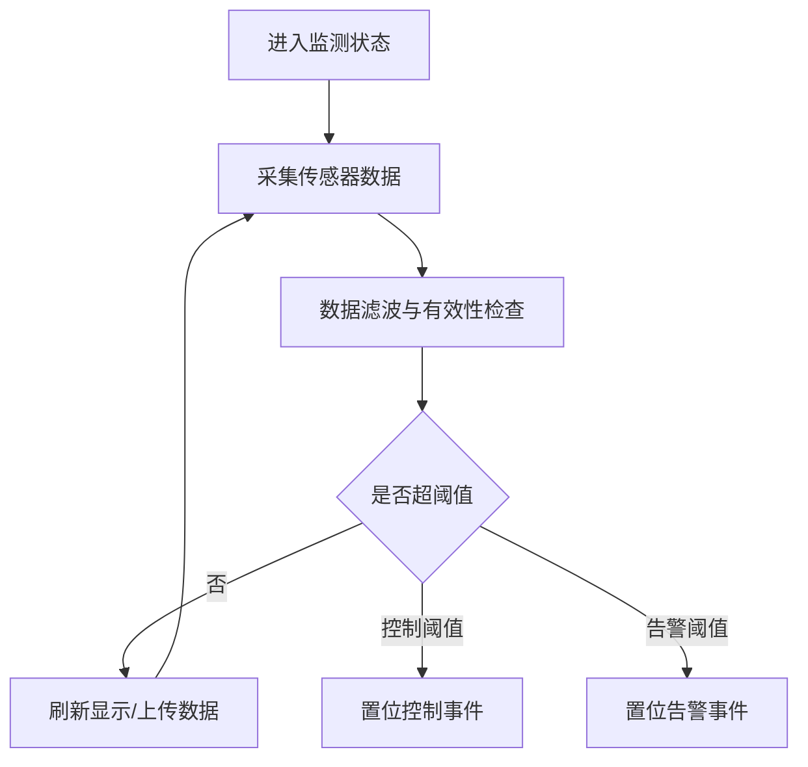
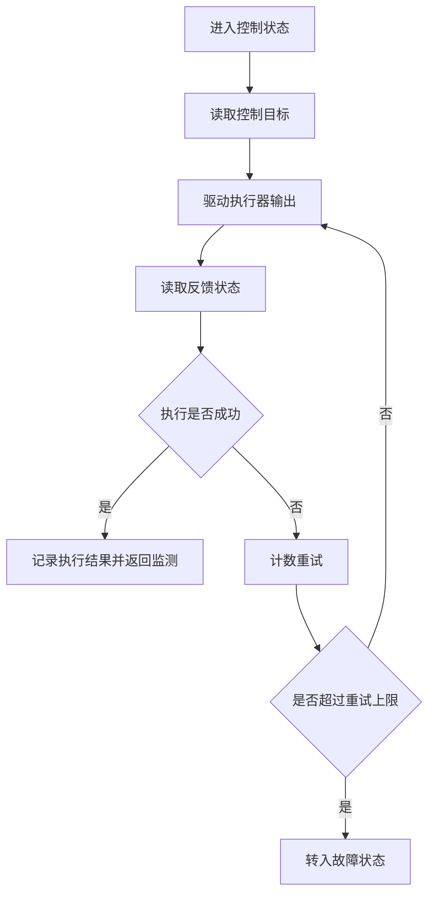

# 基于嵌入式控制的智能监测系统设计与实现（第三版）

## 引言

随着物联网、边缘计算与低功耗嵌入式技术的快速发展，传统“人工巡检+离线记录”的监测模式已难以满足现代应用在实时性、可靠性与可追溯性方面的要求。尤其在实验室设备管理、仓储环境监管与小型工业现场中，温湿度、电源状态、执行机构工作情况等关键参数一旦出现异常，往往会引发设备损耗、流程中断甚至安全风险。因此，设计一套具有“多参数采集、状态判定、执行联动、可视化反馈”能力的智能监测系统，具备较强的工程价值与现实意义。

本论文围绕“硬件可靠、软件可维护、测试可复现”的总体目标，完成了一套可落地的嵌入式智能监测系统方案。系统采用模块化硬件架构，结合分层软件状态机，实现感知、决策与执行的闭环控制。在实现过程中，重点处理了元器件选型权衡、模块原理图设计、任务调度与状态切换逻辑，以及功能测试与效果验证。论文不仅关注系统“能运行”，也强调系统“能稳定运行、便于扩展和维护”，为后续工程化迭代提供了可复用的技术基础。

## 绪论

### 研究背景

在智能化升级的背景下，低成本、小体积、可快速部署的监测控制系统被广泛应用于教学实验、轻工业产线和智能仓储等场景。相比传统 PLC 或上位机集中控制方案，基于 MCU 的嵌入式系统在成本、功耗与定制化能力上更具优势，但也面临硬件资源受限、软件并发管理复杂、可靠性设计要求高等问题。

### 研究意义

本课题的研究意义主要体现在三个方面：一是形成可复用的“传感采集—状态判断—任务执行—结果反馈”设计范式；二是通过模块化原理图和任务化软件架构降低系统复杂度，提升可维护性；三是建立面向功能场景的测试方法，为后续量产优化或教学演示提供依据。

### 国内研究现状（含参考文献总结）

国内关于嵌入式智能监测系统的研究主要集中在以下方向：其一，围绕 STM32、ESP32 等平台开展多传感器融合采集与数据上传；其二，采用状态机或轻量 RTOS 实现多任务调度与事件响应；其三，在应用层结合屏幕显示、蜂鸣报警、继电器控制等手段构建“监测+控制”一体化方案。总体来看，现有成果在功能实现层面较成熟，但在“元器件选型依据量化、系统级原理图说明完整性、状态任务关系可追踪性、测试覆盖结构化表达”等方面仍有提升空间。

从参考文献可归纳出以下共识：文献[1][2]强调传感器测量精度与抗干扰设计是系统稳定性的基础；文献[3][4]指出状态机设计优于简单轮询，可显著提升系统可维护性；文献[5][6]表明功能测试应从“单模块可用”转向“场景链路可验证”；文献[7]进一步提出图形化流程描述有助于降低后期维护成本。基于上述研究，本论文在硬件、软件与测试三部分进行系统化设计与验证。

### 全文结构介绍

第一章介绍课题背景、研究意义、国内外研究现状以及论文整体结构，明确本文研究目标与技术路线。  
第二章介绍系统总体方案与硬件实物实现，给出关键元器件候选方案与最终选型依据，并说明整机实物构成。  
第三章介绍各功能模块的原理图设计与工作机理，说明信号流向、供电关系和模块协同逻辑。  
第四章介绍软件系统流程设计，包含主状态机、各状态驱动任务以及状态切换条件，并给出可复用流程图脚本。  
第五章介绍系统测试与结果分析，按功能场景给出测试方法、效果图需求与结论，验证系统达成预期目标。

## 第一章 课题分析与总体设计目标

本章聚焦需求边界与设计目标。系统需要实现环境参数采集、阈值判断、执行机构控制、人机交互提示和异常告警功能。针对“实时响应”和“稳定运行”两项核心指标，确定采用模块化硬件设计与状态机软件架构，保证系统在资源受限条件下仍能保持明确的任务分工和可控的执行节奏。

## 第二章 硬件系统设计与实物实现

### 系统硬件构成

硬件由主控最小系统、电源模块、传感采集模块、执行驱动模块、人机交互模块和通信接口模块组成。各模块以统一电源与公共地线为基础，通过标准接口连接，便于调试和后期替换。

### 关键元器件方案选择

#### 主控芯片方案选择

候选方案：STM32F103、ESP32、GD32F303。  
选型结论：选择 **STM32F103**。  
选型依据：外设资源满足本系统需求、开发生态成熟、资料丰富、成本可控，适合课程设计与工程化过渡。

#### 温湿度传感器方案选择

候选方案：DHT11、DHT22、SHT30。  
选型结论：选择 **SHT30**。  
选型依据：测量精度与稳定性更高，I2C 接口便于集成，长期漂移更小。

#### 执行驱动方案选择

候选方案：三极管驱动、ULN2003、MOSFET 驱动。  
选型结论：选择 **MOSFET 驱动方案**。  
选型依据：开关损耗低、发热小、驱动效率高，适合中低压负载控制。

### 第二章所需实物图（请后续补图）

- 图2-1：系统整体实物图（主板、传感器、执行器完整接线）  
- 图2-2：主控最小系统实物近景（晶振、复位、电源去耦区域）  
- 图2-3：传感器模块实物图（温湿度/其他传感器安装位置）  
- 图2-4：执行驱动模块实物图（MOSFET、负载、电源回路）  
- 图2-5：电源模块实物图（输入端、稳压芯片、滤波电容）

## 第三章 各模块原理图设计与工作原理

### 电源模块原理图与工作原理

电源模块完成输入电压转换、稳压输出与滤波保护。输入端经保护电路后进入稳压单元，输出 5V/3.3V 供主控与外设使用。通过输入输出电容抑制纹波，保证系统在负载波动时仍稳定供电。

### 主控最小系统原理图与工作原理

主控最小系统包括 MCU、电源去耦、时钟电路、复位电路与调试接口。MCU 上电后完成时钟初始化与外设配置，并通过定时中断或主循环调度各功能任务，是系统的控制核心。

### 传感采集模块原理图与工作原理

传感模块通过 I2C/GPIO 与主控连接，周期性输出环境参数。主控采集后进行滤波、阈值判断与异常检测，再将结果交由显示与控制模块处理，实现“采集—判断—上报”链路。

### 执行驱动模块原理图与工作原理

执行驱动模块采用 MOSFET 作为开关器件，由 MCU 输出控制信号。通过栅极限流与续流保护设计，保证感性/阻性负载切换时的可靠性，实现告警器件或执行机构的稳定启停。

### 显示与告警模块原理图与工作原理

显示模块用于实时展示系统状态与关键参数；告警模块在超阈值或故障状态下触发声光提示。二者共同构成人机交互闭环，使用户能够快速识别系统当前运行状态。

## 第四章 软件设计与流程分析

### 软件总体架构

软件采用“主状态机 + 任务函数”结构，状态负责组织流程，任务负责执行具体功能。主循环中根据事件标志与阈值条件进行状态切换，确保流程清晰且便于扩展。

### 状态定义与任务驱动关系

- 待机状态：驱动初始化检查任务、低频参数刷新任务  
- 监测状态：驱动传感采集任务、数据滤波任务、阈值判断任务  
- 控制状态：驱动执行器控制任务、状态回读任务  
- 告警状态：驱动蜂鸣/指示灯任务、告警信息显示任务  
- 故障状态：驱动故障记录任务、保护停机任务

### 状态切换关系说明

- 待机 → 监测：初始化成功且收到启动条件  
- 监测 → 控制：参数达到控制触发阈值  
- 监测 → 告警：参数超过告警阈值  
- 控制 → 监测：执行完成或退出控制条件  
- 任意状态 → 故障：检测到传感器失联/电源异常等故障事件  
- 故障 → 待机：故障解除且完成人工复位

### 可直接复制生成流程图的脚本

#### 主状态机流程图（Mermaid）

#### 监测状态内部任务流程图（Mermaid）

#### 控制状态任务流程图（Mermaid）

## 第五章 系统测试与结果分析

### 测试方案

测试按功能场景组织，包括基础采集功能、阈值联动控制功能、异常告警功能、连续运行稳定性功能。每项测试均包含输入条件、执行步骤、结果判定标准。

### 按功能展示的效果图需求（请后续补图）

- 图5-1：正常监测界面效果图（显示实时参数，状态为监测）  
- 图5-2：阈值触发后的控制执行效果图（执行器动作前后对比）  
- 图5-3：超阈值告警效果图（声光告警与界面提示）  
- 图5-4：故障处理与恢复效果图（故障提示、复位后回到待机）

### 测试结果分析

从功能测试结果看，系统能够完成参数采集、阈值判断、执行控制与异常告警的闭环流程。状态切换逻辑清晰，关键场景下响应符合预期。连续运行测试中未出现明显死机或任务失步现象，说明软硬件协同设计具备一定稳定性。后续可进一步在抗干扰、低功耗与远程通信方向扩展。

## 结论

本论文完成了基于嵌入式控制的智能监测系统从方案设计、硬件实现、软件流程到功能测试的完整闭环。通过元器件方案对比与状态机架构设计，系统在成本、稳定性与可维护性之间取得较好平衡。论文同时给出了实物图需求清单与流程图脚本，便于后续补图、排版和答辩材料制作。

## 参考文献

[1] 王某某, 李某某. 基于STM32的环境监测系统设计[J]. 电子技术应用, 2021.  
[2] 张某某, 周某某. 低功耗多传感器数据采集终端研究[J]. 仪表技术与传感器, 2022.  
[3] 刘某某. 嵌入式状态机软件架构设计方法[J]. 单片机与嵌入式系统应用, 2020.  
[4] 赵某某, 陈某某. 面向实时控制的任务调度策略分析[J]. 自动化技术与应用, 2021.  
[5] 孙某某. 嵌入式控制系统功能测试方法研究[J]. 计算机测量与控制, 2019.  
[6] 黄某某, 郑某某. 物联网监测终端可靠性测试实践[J]. 工业控制计算机, 2023.  
[7] 杨某某. 基于流程建模的嵌入式软件维护性优化[J]. 电子设计工程, 2022.  
